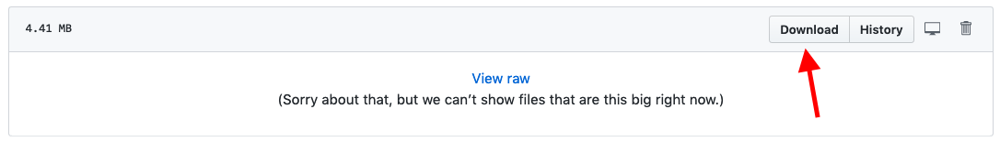

# Beschreibung
Diese Kognitionstests wurden von Maria Kliesch für die Studie "New languages and old brains: 
A dynamic approach to language learning in third age" erstellt. Sie werden den ehemaligen
Teilnehmenden der Studie auf ihren Wunsch weiterhin zur Verfügung gestellt.

**Inhalt**:
* Allgemeiner Wachsamkeits/Reaktionsgeschwindigkeitstest ("Alertness")
* Test der geteilten Aufmerksamkeit ("Divided Attention")
* Test des einfachen Arbeitsgedächtnisses ("NBack")
* Test des komplexen Arbeitsgedächtnisses ("Operation Span")
* Inhibitionstest ("Go-No-Go")

Stimuli und Testaufbau werden in Kliesch & Pfenninger (unter Review) erklärt. 

# Anleitung

## Download von PsychoPy 1.90.1

1. Wenn Sie einen Windowscomputer haben, laden Sie das Programm von folgendem Link herunter:
[https://github.com/psychopy/psychopy/releases/download/1.90.1/StandalonePsychoPy2_PY3-1.90.1-win32.exe](PsychoPy für Windows)
   
Wenn Sie einen Mac-Computer haben, laden Sie das Programm von folgendem Link herunter:
[https://github.com/psychopy/psychopy/releases/download/1.90.1/StandalonePsychoPy2_PY3-1.90.1b-MacOS.dmg](PsychoPy für Mac)

2. Öffnen Sie die heruntergeladene Datei und folgen Sie den Installationsanweisungen. 

3. Am Schluss sollte sich auf Ihrem Computer das Programm *PsychoPy* mit folgendem Logo befinden:
. 

4. Öffnen Sie *PsychoPy*. Beim ersten Mal kann dies bis zu ein paar Minuten dauern. 
  
.

## Öffnen der Tests

1. Gehen Sie zurück auf die Webseite, auf der Sie diese Anleitung gefunden haben und klicken 
Sie im selben Ordner auf die Datei "Test.zip". 
Folgende Ansicht erscheint:

2. Klicken Sie auf "Download", wie in der Darstellung oben gezeigt und speichern Sie die Datei auf Ihren Computer.

3. Für Windows: Suchen Sie die heruntergeladene Datei auf Ihrem Computer, klicken Sie mit 
rechts darauf, und wählen Sie "Hier entpacken" (oder ähnliches).    
Für Mac: Suchen Sie die heruntergeladene Datei auf Ihrem Computer und öffnen Sie sie mit einem Doppelklick.

4. Nun müsste am gleichen Ort wie die Zip-Datei ein Ordner namens "Tests" entstanden sein. Öffnen Sie diesen.

5. Die für Sie relevanten Dateien sind die fünf, die mit einen doppelten Unterstrich (__) beginnen. 
Wählen Sie eine aus (__Alertness, __OperationSpan, __DividedAttention, __GoNoGo, oder __NBack) und ziehen Sie 
sie in das geöffnete *PsychoPy*-Fenster. Ein Skript sollte aufgehen. Falls das nicht funktionieren, klicken Sie
in *PsychoPy* auf das Öffnen Symbol  und suchen Sie die zu öffnende Datei auf diese Weise.

6. Wenn Sie ein Skript aus grüner, roter, blauer und schwarzer Schrift vor sich sehen, sind Sie richtig.
Sie können nun den Test mittels der grünen Starttaste  beginnen. Haben Sie etwas Geduld,
bis der Test geladen ist. Bei "Participant" und "Session" müssen Sie nichts eintragen. Sie können einfach
die Enter-Taste drücken.

7. Um einen Test abzubrechen, drücken Sie die "esc"-Taste.

# Bibliografie
Kliesch, M., Pfenninger S. (unter Review). Cognitive and Socio-Affective Predictors of L2 
Micro-Development in Late Adulthood: A Longitudinal Intervention Study.